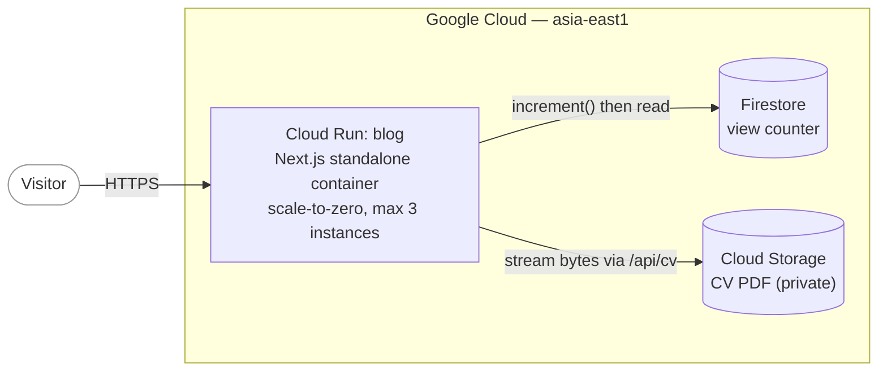
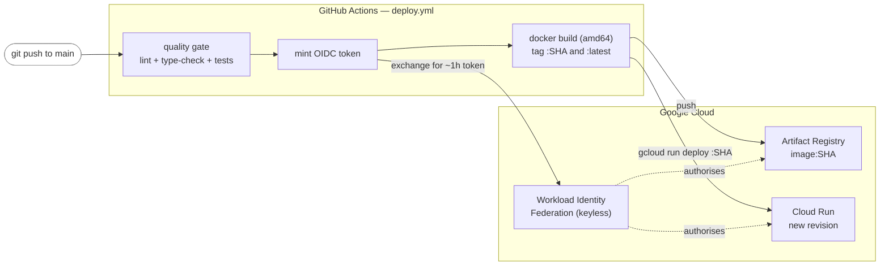
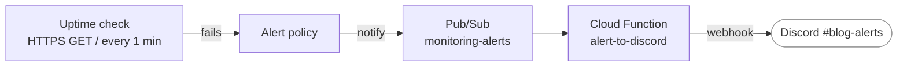

# Blog

A personal blog and writing space, built from scratch and shipped to Google Cloud
Run. It doubles as a hands-on cloud-engineering project — the goal was to learn
Docker, CI/CD, and GCP deeply by taking the manual path first, then automating it.

**Live:** https://albertt.dev

<!-- TODO: add a screenshot once the home page bio is finalised.
     Capture light + dark, save to docs/screenshot.png, then:
      -->

## Stack

- **Framework:** Next.js 16 (App Router) + React 19, TypeScript
- **Styling:** Tailwind CSS v4, `@tailwindcss/typography`; serif reading face
  (STIX Two Text) with Geist / Geist Mono for UI and code
- **Content:** MDX in `content/posts/`, rendered with `next-mdx-remote` +
  `gray-matter`; syntax highlighting by `rehype-pretty-code` + Shiki at build time
  (zero client JS, dual light/dark theme)
- **Dark mode:** `next-themes`, class-based, persisted in `localStorage`
- **State:** Firestore (view counter) + Cloud Storage (CV PDF)
- **Hosting:** GCP Cloud Run (containerised, scale-to-zero), `output: "standalone"`
- **CI/CD:** GitHub Actions + Workload Identity Federation (no service-account keys)
- **Testing:** Vitest unit tests (session crypto, MDX parsing, TOC extraction,
  bot filtering), gating every deploy in CI
- **Tooling:** pnpm, Node 22, Docker

## Architecture

**Serving a request.** A visitor hits the Cloud Run service, which runs the
Next.js standalone server in a container. Most of the site is static (SSG); the
two stateful features reach out to managed backends — Firestore for the view
counter and a private Cloud Storage bucket for the CV.



**Shipping a change.** A push to `main` triggers GitHub Actions. A quality gate
(ESLint, type-check, unit tests) must pass first; the deploy job then
authenticates to GCP by exchanging a short-lived OIDC token for a GCP access
token (Workload Identity Federation — no long-lived JSON keys live in the repo,
and the trust is pinned so only workflows on this repo's `main` branch can
exchange a token at all). It builds the image, pushes it to Artifact Registry
tagged with the commit SHA, and deploys that exact image to Cloud Run as a new
revision.



**Two identities, least privilege.** The pipeline and the running app use
separate service accounts, each scoped to only what it needs:

- **Deployer SA** (used by CI): `run.developer` + `artifactregistry.writer` +
  `serviceAccountUser`. It can build and deploy, but has no IAM-admin rights, so
  the pipeline can't change who is allowed to invoke the service.
- **Runtime SA** (used by the container): `datastore.user` +
  bucket-scoped `storage.objectViewer`. It can read the counter and the CV, and
  nothing else.

**Secrets stay out of everything.** The admin password, the session-signing key,
and the Discord webhook live in Secret Manager and are injected at runtime; each
service account can read only the secrets it needs. The secret *values* are added
out-of-band (`gcloud secrets versions add`), so they never pass through the repo,
CI logs, or Terraform state.

**Observability.** A Cloud Monitoring uptime check probes the home page every
minute from three continents. If it fails from more than one location, an alert
policy fires and routes — via a Pub/Sub topic and a Cloud Function — to a Discord
channel. A dashboard tracks request rate, latency, and instance count.



## Design decisions

The "why" behind the non-obvious choices:

- **`output: "standalone"`** — Next traces only the files the server actually
  needs into a self-contained bundle, so the runtime Docker image stays small and
  doesn't ship the full `node_modules`.
- **Content-addressed, immutable deploys** — every image is tagged with its
  commit SHA and *that* tag is what gets deployed. Rollback is redeploying an
  older SHA; the running revision is always traceable back to a commit.
- **Keyless deploys (Workload Identity Federation)** — GitHub Actions trades its
  OIDC token for a short-lived GCP token at run time. No JSON service-account key
  is ever stored in the repo or in GitHub secrets — nothing to leak or rotate.
- **Stateless compute + external state** — Cloud Run scales to zero and runs
  multiple interchangeable instances with ephemeral disk, so an in-process
  counter would reset and diverge. The counter lives in Firestore and uses an
  atomic `FieldValue.increment(1)` to stay correct under concurrency. This is the
  core horizontal-scaling pattern.
- **CV served through the app, bucket stays private** — `/api/cv` streams the PDF
  from a private bucket using the runtime SA, counting one download per request.
  The bucket is never publicly exposed.
- **Cloud-neutral data layer (ports and adapters)** — application code depends on
  small interfaces (`ViewCounter`, `FileStore` in `src/lib/store.ts`), never on a
  vendor SDK directly. The Google Cloud SDK lives behind one adapter
  (`src/lib/adapters/gcp.ts`) — the only file that imports `@google-cloud/*`.
  Moving a backend (say Postgres for the counter, or S3 for the file) is a
  two-line rebind in the composition root with no other app changes. This is the
  hexagonal (ports-and-adapters) pattern, and a concrete take on avoiding vendor
  lock-in: most coupling is confined to one swappable file.
- **Signed session cookie, never the password** — the `/admin` session cookie
  holds an HMAC-signed, self-expiring token (the standard signed-cookie
  construction, on `node:crypto`), verified in constant time. A leaked cookie
  can't be reversed into the password or outlive its expiry, and rotating the
  signing key invalidates every session at once.
- **`max_instances` as the real cost ceiling** — a billing budget only *alerts*;
  capping instances is what actually bounds spend. It's set to 3 and declared in
  Terraform (`terraform/cloudrun.tf`), which owns the service configuration; CI
  only ever swaps the image.
- **Bounded image history** — an Artifact Registry cleanup policy retains the
  last 30 days of images but always the 10 newest (KEEP outranks DELETE), so
  per-commit pushes can't grow storage forever while recent rollback targets
  stay available.
- **Alerting via Pub/Sub fan-out, not a direct webhook** — Cloud Monitoring has no
  native Discord channel, so the alert policy publishes to a Pub/Sub topic and a
  Cloud Function formats and forwards it. Pub/Sub decouples the alert source from
  the delivery code (the same shape as SNS in front of a Lambda), so a second
  destination later is another subscriber, not a change to the policy. The whole
  monitoring stack is declared in Terraform (`terraform/`) and imported into
  state, so it's reproducible, reviewable as a diff, and drift-checked with
  `terraform plan`.
- **`localStorage` for the theme, not a cookie** — reading a cookie in the root
  layout would force the whole site out of static rendering into dynamic
  rendering. The theme is applied client-side instead, keeping pages static.
- **English-only, not i18n** — the blog targets an international tech audience.
  i18n's real cost is the per-post content tax (every post written and kept in
  sync twice), which isn't worth it for a solo blog. Match rigour to stakes.

## Local development

```bash
pnpm install
pnpm dev
```

Open http://localhost:3000. The same three checks CI gates deploys on run
locally as:

```bash
pnpm lint && pnpm typecheck && pnpm test
```

The CV and view-counter routes talk to Firestore and Cloud Storage, so they need
Google credentials. Locally, run `gcloud auth application-default login` once to
supply them; without it, `/api/cv` and `/admin` return errors but the rest of the
site works normally.

## Deployment

Deploys are automatic: pushing to `main` runs `.github/workflows/deploy.yml`,
which builds the image and rolls out a new Cloud Run revision (see the CI/CD
diagram above). The workflow can also be triggered by hand from the Actions tab.

To build the image locally (e.g. on Apple Silicon), target the architecture Cloud
Run expects:

```bash
docker build --platform linux/amd64 -t blog .
```

## Repository layout

```
content/posts/        MDX blog posts (frontmatter + body)
src/app/              App Router: pages, layout, route handlers
  api/cv/             streams the CV, increments the counter
  api/admin/          minimal password-gated session for /admin
  admin/              view-count dashboard
src/lib/              app-side libraries
  store.ts            cloud-neutral ports (ViewCounter, FileStore) + composition root
  adapters/gcp.ts     the only module that imports the Google Cloud SDK
  posts.ts            MDX posts loader
  toc.ts              extracts h2/h3 headings from MDX for the table of contents
  auth.ts             admin session helpers (HMAC-signed session tokens)
  bots.ts             user-agent bot filter for the view counter
  *.test.ts           Vitest unit tests (run in CI; never traced into the image)
terraform/            infrastructure as code — the Cloud Run service, secrets +
                      IAM, CI/CD identity (WIF), monitoring, budget, and data
                      backends (Firestore, GCS bucket, Artifact Registry)
functions/            standalone Cloud Functions (source)
  alert-to-discord/   relays alerts from Pub/Sub to a Discord webhook
Dockerfile            multi-stage build → standalone runtime image
.github/workflows/    CI/CD (deploy to Cloud Run)
```
